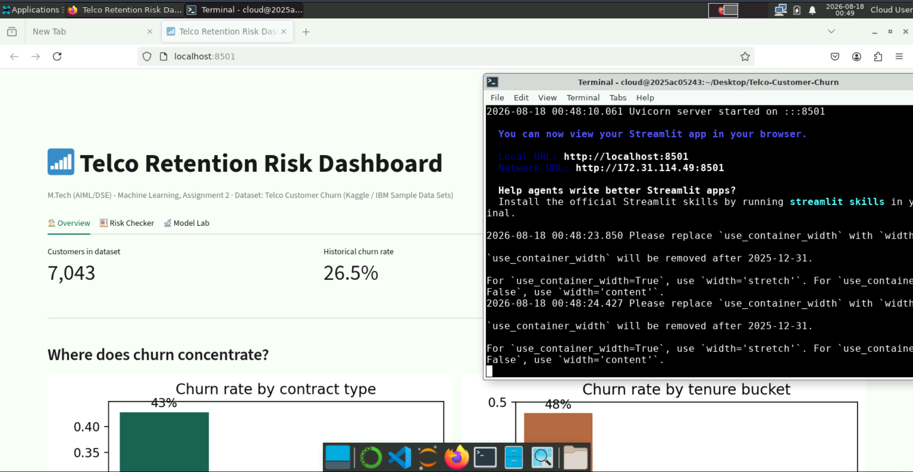

# Assignment 2 — Machine Learning (M.Tech AIML/DSE, BITS Pilani WILP)

## a. Problem Statement

Customer churn — a subscriber discontinuing service — is one of the most common binary classification problems in the telecom industry. Retaining an existing customer is far cheaper than acquiring a new one, so being able to flag at-risk customers early has direct business value. This assignment implements and compares five classification algorithms that predict whether a telecom customer will churn based on their account, billing, and service usage attributes, evaluates them with six standard metrics, and exposes the models through an interactive Streamlit web application.

## b. Dataset Description

* **Name:** Telco Customer Churn (IBM Sample Data Sets)
* **Source:** Originally published on Kaggle —
  https://www.kaggle.com/datasets/blastchar/telco-customer-churn
  (the identical file is mirrored on IBM's own GitHub repository and was used directly here:
  https://raw.githubusercontent.com/IBM/telco-customer-churn-on-icp4d/master/data/Telco-Customer-Churn.csv)
* **Instances:** 7,043 customers
* **Features:** 19 usable features after dropping the `customerID` identifier column — demographic (gender, senior citizen, partner, dependents), account info (tenure, contract type, payment method, paperless billing, monthly/total charges), and service usage (phone, multiple lines, internet type, online security/backup, device protection, tech support, streaming TV/movies). Categorical columns were label-encoded to numeric for modeling.
* **Target:** Binary — `Churn`: `1 = customer left`, `0 = customer stayed`
* **Class balance:** ~26.5% churn / ~73.5% no-churn (moderately imbalanced)
* **Preprocessing:** `TotalCharges` had 11 blank values (new customers with 0 tenure) — coerced to numeric and imputed with the column median.
* **Train/test split:** 80% / 20%, stratified, `random_state=42`

Both minimum requirements are satisfied: 19 features (≥ 12 required) and 7,043 instances (≥ 500 required).

## c. GitHub Repository Link

https://github.com/ashkun1998/Telco-Customer-Churn

## d. Models Used

All 5 models were trained on the same train/test split of the dataset above. Logistic Regression and kNN were trained on standardized features (`StandardScaler`); Decision Tree, Naive Bayes, and Random Forest were trained on the raw (label-encoded) features.

### Comparison Table (evaluated on the 20% held-out test set, 1,409 samples)

| ML Model Name            | Accuracy | AUC    | Precision | Recall | F1     | MCC    |
| ------------------------ | -------- | ------ | --------- | ------ | ------ | ------ |
| Logistic Regression      | 0.7991   | 0.8403 | 0.6426    | 0.5481 | 0.5916 | 0.4621 |
| Decision Tree            | 0.7786   | 0.7993 | 0.6033    | 0.4840 | 0.5371 | 0.3980 |
| kNN                      | 0.7771   | 0.8016 | 0.5882    | 0.5348 | 0.5602 | 0.4123 |
| Naive Bayes              | 0.7452   | 0.8204 | 0.5141    | 0.7326 | 0.6042 | 0.4392 |
| Random Forest (Ensemble) | 0.7977   | 0.8307 | 0.6450    | 0.5294 | 0.5815 | 0.4536 |

*(Generated by `model/train_models.py`; raw values are also saved to `model/saved_models/results.csv`.)*

### Observations

| ML Model Name                        | Observation about model performance                                                                                                                                                                                                                                                                                                             |
| ------------------------------------ | ----------------------------------------------------------------------------------------------------------------------------------------------------------------------------------------------------------------------------------------------------------------------------------------------------------------------------------------------- |
| Logistic Regression                  | Best overall performer (Accuracy 0.799, AUC 0.840, MCC 0.462) — the churn signal in this dataset (contract type, tenure, monthly charges) turns out to be largely linear/additive, which favors a linear decision boundary and also keeps the model easy to interpret for a business stakeholder.                                               |
| Decision Tree                        | Weakest on AUC and MCC (0.799 / 0.398) even with depth capped at 8 to limit overfitting. A single tree's hard axis-aligned splits struggle to capture the smoother, more gradual churn-risk trends (e.g. tenure, charges) that a linear or ensemble model handles better.                                                                       |
| kNN                                  | Middle of the pack (Accuracy 0.777, MCC 0.412). With 19 mixed categorical/numeric features, Euclidean distance after scaling is a reasonable but imperfect similarity measure — label-encoded categorical columns (e.g. contract type, payment method) don't have a natural distance interpretation, which likely caps kNN's ceiling here.      |
| Naive Bayes                          | Lowest accuracy (0.745) but by far the highest recall (0.733) — its independence assumption causes it to over-predict the churn class, which hurts precision but means it catches the most actual churners. In a retention-campaign setting where missing a churner is costlier than a false alarm, this trade-off could actually be desirable. |
| Random Forest (Ensemble)             | Second-best overall (Accuracy 0.798, AUC 0.831, MCC 0.454) — clearly better than the single Decision Tree on every metric, confirming the expected benefit of averaging over many trees, and it closes most of the gap to Logistic Regression on this dataset.                                                                                  |
| **Overall Winner for your dataset?** | **Logistic Regression** — highest Accuracy, AUC, F1, and MCC of all five models (Random Forest is a close second; Naive Bayes leads only on Recall).                                                                                                                                                                                            |

## Repository Structure

```text
project-folder/
├── app.py                     # Streamlit application
├── requirements.txt
├── README.md
├── test_data.csv              # held-out test split (features + true label)
├── telco_raw.csv              # original downloaded dataset (pre-cleaning)
└── model/
    ├── train_models.py        # trains all 5 models, computes metrics, saves artifacts
    └── saved_models/          # *.joblib model files, scaler, encoders, feature list, results.csv
```

## Streamlit App Features

Rather than a single generic "upload CSV → pick model → see metrics" page, the app is built as a 3-tab **Telco Retention Risk Dashboard**:

1. **🏠 Overview** — dataset story: total customers, overall churn rate, and churn-rate breakdowns by contract type and tenure bucket (bar charts).
2. **🧮 Risk Checker** — a hand-filled single-customer form (gender, tenure, contract, services, billing, etc.) that scores that one customer live against any of the 5 models, shows a colour-coded risk badge (LOW / WATCH / HIGH RISK) with the churn probability, and — for tree/ensemble models — a feature-importance chart of what's driving that model's decisions overall.
3. **🔬 Model Lab** — batch evaluation: use the bundled held-out test split or upload your own CSV, pick a model from the dropdown, see predictions (downloadable as CSV), Accuracy/AUC/Precision/Recall/F1/MCC, confusion matrix, classification report, and a side-by-side bar chart comparing all 5 models across every metric.

This satisfies the required feature set (CSV upload, model selection dropdown, metrics display, confusion matrix / classification report) while framing the tool around an actual retention-analyst workflow instead of a boilerplate template.

The app ships a `.streamlit/config.toml` that locks a consistent teal-themed light appearance regardless of the viewer's browser/OS dark-mode setting — this replaced an earlier CSS-injection approach that only overrode the background color and left some widget text on Streamlit's dark-theme default, making it invisible for viewers with dark mode enabled.

## How to Run Locally

```bash
pip install -r requirements.txt
python model/train_models.py   # regenerates models + test_data.csv (already included)
streamlit run app.py
```

## Live Deployment

* **Streamlit App:** https://telco-customer-churn-2025ac05243.streamlit.app/
* **BITS Virtual Lab execution screenshot:** included in the final submission PDF.
* 
